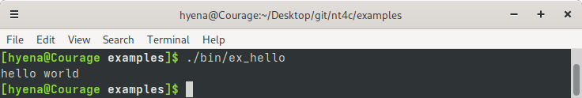
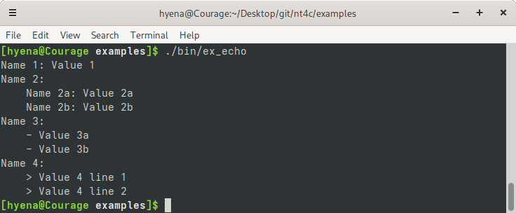
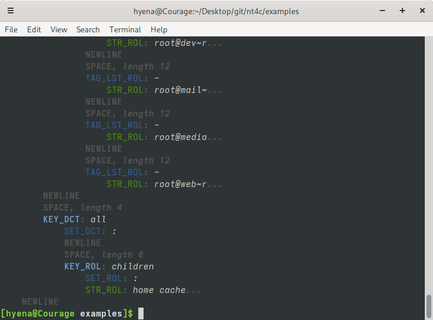

# NT4C Readme ##################################################################

* Home: https://github.com/1Hyena/nt4c
* Issue tracker: https://github.com/1Hyena/nt4c/issues

NT4C stands for "NestedText for C" and that is exactly what this project is
about.

## What is NestedText ##########################################################

In short, NestedText is a file format for holding structured data.

The following resources can explain more if you are unfamiliar with it:
* [Documentation](https://nestedtext.org/)
* [Questions, suggestions and issues](https://github.com/KenKundert/nestedtext)

## What is NT4C

NT4C is a NestedText parser implementation written in accordance with the C23
standard of the C programming language. It includes the following features:

* **Compliance:** NT4C aims to comply with the latest version of the
  [NestedText specification](https://nestedtext.org/). However, it is currently
  only compliant with the
  [Minimal NestedText](https://nestedtext.org/en/latest/minimal-nestedtext.html)
  specification.

* **Performance:** NT4C is fast as it does not involve any heap memory
  allocations. It also avoids unnecessary memory copying by directly referencing
  the input text in the resulting graph.

* **Compactness:** The NT4C parser is implemented in a single header file with
  no dependencies other than the standard C library.

* **Embedding:** The NT4C parser is easily reusable in other projects with a
  simple API that includes a few key functions, primarily `nt_parse()`.

* **Tree model:** NT4C parses the entire document and constructs a graph (DOM)
  where each node directly references a segment from the input string.

* **Portability:** NT4C builds and functions on Linux. It should be relatively
  simple to make it run on most other platforms as long as the platform provides
  the C standard library.

* **Encoding:** NT4C expects UTF-8 encoding of the input text and does not
  attempt to detect Unicode encoding errors.

* **Permissive license:** NT4C is available under the [MIT license](LICENSE).

## Using NT4C ##################################################################

### Parsing NestedText #########################################################

To parse a NestedText document, you can include the [nt4c.h](nt4c.h) header file
directly in your codebase. The parser is implemented in a single C header file
for easy integration.

The main function to use is `nt_parse()`, which takes a text in NestedText
syntax and a pointer to the `NT_PARSER` structure for customizing the
deserialization process.

The `NT_PARSER` structure stores parsing configuration and the parsing process
state. By default, it can handle up to `NT_PARSER_NCOUNT` nodes in its internal
memory. However, you can use the `nt_parser_set_memory` function to work with a
custom array of `NT_NODE` structures.

When you call `nt_parse()`, the parser populates the deserialization graph of
the document with nodes. It continues processing even if the output buffer
reaches its capacity.

After a successful parsing operation, `nt_parse()` returns the number of nodes
in the input text. This information can help you determine the memory required
for storing the deserialization graph. If parsing fails, the function returns a
negative value.

The deserialization graph is considered fully stored when the value returned by
`nt_parse()` is non-negative and does not exceed the output buffer's capacity.

### API ########################################################################

https://github.com/1Hyena/nt4c/blob/acc5fe1d535e66a7bd24b6def2de34ba2521d3c2/nt4c.h#L76-L81

https://github.com/1Hyena/nt4c/blob/acc5fe1d535e66a7bd24b6def2de34ba2521d3c2/nt4c.h#L42-L73

Specify the size of the integrated memory buffer of the `NT_PARSER` structure by
defining the `NT_PARSER_NCOUNT` macro before including the `nt4c.h` header. The
integrated memory was added to increase the API usage convenience in cases where
the size of the input document is always known to be small (see
[ex_hello](examples/src/ex_hello.c) and [ex_pretty](examples/src/ex_pretty.c)).

https://github.com/1Hyena/nt4c/blob/acc5fe1d535e66a7bd24b6def2de34ba2521d3c2/nt4c.h#L35-L37

### Examples ###################################################################

#### ex_hello ##################################################################

The [ex_hello](examples/src/ex_hello.c) example demonstrates how to use the NT4C
parser to generate the text "hello world" and display it on the screen.

https://github.com/1Hyena/nt4c/blob/1f8595884201722495c089d4b45086a23465b84a/examples/src/ex_hello.c#L5-L15

#### ex_echo ###################################################################

[This example](examples/src/ex_echo.c) demonstrates how to utilize the NT4C
parser to parse and display a NestedText document on the screen. The input
document undergoes parsing twice. Initially, the length of the document is
calculated. Subsequently, a variable-length array is set up to store the
Document Object Model (DOM).

https://github.com/1Hyena/nt4c/blob/1f8595884201722495c089d4b45086a23465b84a/examples/src/ex_echo.c#L10-L34

#### ex_pretty #################################################################

[This example](examples/src/ex_pretty.c) shows how to use the NT4C parser to
pretty-print a NestedText document. It reformats the input text and adds syntax
highlighting.

https://github.com/1Hyena/nt4c/blob/1f8595884201722495c089d4b45086a23465b84a/examples/src/ex_pretty.c#L65-L74

Here is a NestedText document before and after pretty-printing, as shown in the
screenshot below:

https://github.com/1Hyena/nt4c/blob/934ab23c1fcf461df2cfb57dfc8e114004588a48/examples/ugly.nt#L1-L29

#### ex_tree ###################################################################

[This example](examples/src/ex_tree.c) shows how to use the NT4C parser to print
the structure of a NestedText document on the screen.

https://github.com/1Hyena/nt4c/blob/1f8595884201722495c089d4b45086a23465b84a/examples/src/ex_tree.c#L79-L97

Here is a screenshot showing the structure of the parsed NestedText document:

# License ######################################################################

NT4C has been authored by Erich Erstu and is released under the [MIT](LICENSE)
license.
