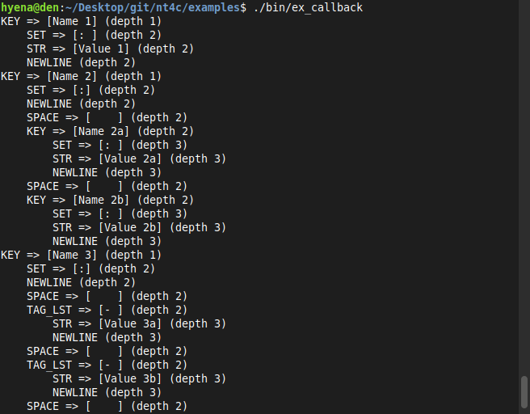
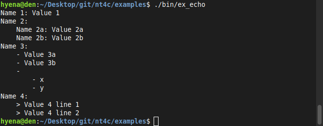
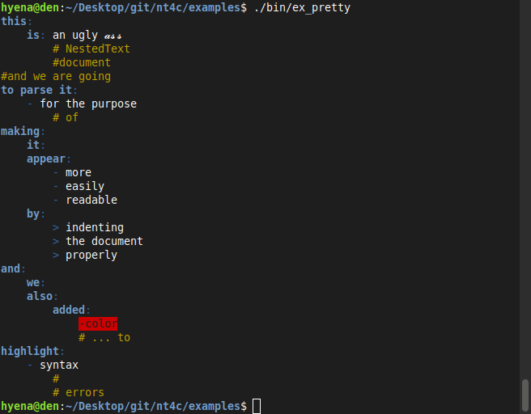
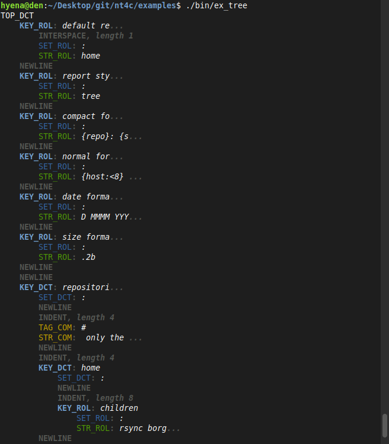
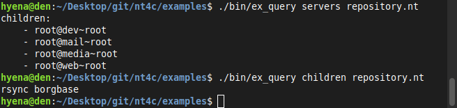

# NT4C Readme ##################################################################

* Version: 1.0.3 (01.05.2026)
* Home: https://github.com/1Hyena/nt4c
* Issue tracker: https://github.com/1Hyena/nt4c/issues

NT4C stands for "NestedText for C" and that is exactly what this project is
about.

## What is NestedText ##########################################################

In short, NestedText is a file format for holding structured data.

The following resources can explain more if you are unfamiliar with it:
* [Documentation](https://nestedtext.org/)
* [Questions, suggestions and issues](https://github.com/KenKundert/nestedtext)

## What is NT4C

NT4C is a NestedText parser implementation written in accordance with the C23
standard of the C programming language. It includes the following features:

* **Compliance:** NT4C aims to comply with the latest version of the
  [NestedText specification](https://nestedtext.org/). However, it is currently
  only compliant with the
  [Minimal NestedText](https://nestedtext.org/en/latest/minimal-nestedtext.html)
  specification.

* **Performance:** NT4C is fast as it does not involve any heap memory
  allocations. It also avoids unnecessary memory copying by directly referencing
  the input text in the resulting graph.

* **Compactness:** The NT4C parser is implemented in a single header file with
  no dependencies other than the standard C library.

* **Embedding:** The NT4C parser is easily reusable in other projects with a
  simple API that includes a few key functions, primarily `nt_parse()`.

* **Callbacks:** NT4C parses the entire document and calls a callback function
  provided by the application to inform it about each NestedText unit.

* **Tree model:** If sufficient memory is provided to the NT4C parser, it
  constructs a graph where each node directly references a segment from the
  input text.

* **Portability:** NT4C builds and functions on Linux. It should be relatively
  simple to make it run on most other platforms as long as the platform provides
  the C standard library.

* **Encoding:** NT4C expects UTF-8 encoding of the input text and does not
  attempt to detect Unicode encoding errors.

* **Permissive license:** NT4C is available under the [MIT license](LICENSE).

## Using NT4C ##################################################################

### Parsing NestedText #########################################################

To parse a NestedText document, you can include the [nt4c.h](nt4c.h) header file
directly in your codebase. The parser is implemented in a single C header file
for easy integration.

The main functions to use are `nt_parse()` and `nt_parser_parse()`. The former
is a convenience function for simple callback based parsing whereas the latter
takes a pointer to the `NT_PARSER` structure as its first argument and is to be
used for customized parsing.

The `NT_PARSER` structure stores parsing configuration and the parsing process
state. By default, it can handle up to `NT_PARSER_NCOUNT` nodes in its internal
memory. However, you can use the `nt_parser_set_memory` function to work with a
custom array of `NT_NODE` structures.

When you call `nt_parser_parse()`, the parser populates the document graph with
nodes. It continues processing even if the output buffer reaches its capacity.

After a successful parsing operation, both `nt_parse()` and `nt_parser_parse()`
return the number of nodes in the input text. This information can help you to
determine the memory required for storing the full graph of the document. If
parsing fails, the function returns a negative value.

The graph of the document is considered fully stored when the value returned by
`nt_parser_parse()` is non-negative and does not exceed the output buffer's
capacity.

### Examples ###################################################################

#### ex_hello ##################################################################

The [ex_hello](examples/src/ex_hello.c) example demonstrates how to use the NT4C
parser to generate the text "hello world" and display it on the screen.

https://github.com/1Hyena/nt4c/blob/490be860ff8b24ee01c52823063be50f85121d91/examples/src/ex_hello.c#L6-L15

#### ex_callback ###############################################################

The [ex_callback](examples/src/ex_callback.c) example demonstrates how to make
the NT4C parser call a user-specified function each time it parses the next
logical portion of the input document.

https://github.com/1Hyena/nt4c/blob/490be860ff8b24ee01c52823063be50f85121d91/examples/src/ex_callback.c#L7-L38

#### ex_echo ###################################################################

[This example](examples/src/ex_echo.c) demonstrates how to utilize the NT4C
parser to parse and display a NestedText document on the screen. The input
document undergoes parsing twice. Initially, the length of the document is
calculated. Subsequently, a variable-length array is set up to store the
Document Object Model (DOM).

https://github.com/1Hyena/nt4c/blob/490be860ff8b24ee01c52823063be50f85121d91/examples/src/ex_echo.c#L23-L36

#### ex_pretty #################################################################

[This example](examples/src/ex_pretty.c) shows how to use the NT4C parser to
pretty-print a NestedText document. It reformats the input text and adds syntax
highlighting.

https://github.com/1Hyena/nt4c/blob/490be860ff8b24ee01c52823063be50f85121d91/examples/src/ex_pretty.c#L71-L77

Here is a NestedText document before and after pretty-printing, as shown in the
screenshot below:

https://github.com/1Hyena/nt4c/blob/490be860ff8b24ee01c52823063be50f85121d91/examples/ugly.nt#L1-L29

#### ex_tree ###################################################################

[This example](examples/src/ex_tree.c) shows how to use the NT4C parser to print
the structure of a NestedText document on the screen.

https://github.com/1Hyena/nt4c/blob/490be860ff8b24ee01c52823063be50f85121d91/examples/src/ex_tree.c#L85-L99

Here is a screenshot showing the structure of the parsed NestedText document:

#### ex_query ##################################################################

The [ex_query](examples/src/ex_query.c) example demonstrates how to query an
arbitrary NestedText document for a specific key and print the contents of the
matching node on screen.

### API ########################################################################

* [Initialization](#initialization)
  - [nt_make_parser](#nt_make_parser) () → `NT_PARSER`
  - [nt_parser_init](#nt_parser_init) (&*parser*)

* [Parsing](#parsing)
  - [nt_parse](#nt_parse) (*text*, *text size*, *callback*, *userdata*) → `int`
  - [nt_parser_parse](#nt_parser_parse) (&*parser*, *text*, *text size*) → `int`

* [Configuration](#configuration)
  - [nt_parser_set_memory](#nt_parser_set_memory) (&*parser*, &*nodes*, *node count*)
  - [nt_parser_set_recursion](#nt_parser_set_recursion) (&*parser*, *depth*)
  - [nt_parser_set_blacklist](#nt_parser_set_blacklist) (&*parser*, *banned types*)
  - [nt_parser_set_whitelist](#nt_parser_set_whitelist) (&*parser*, *allowed types*)
  - [nt_parser_set_userdata](#nt_parser_set_userdata) (&*parser*, &*userdata*)
  - [nt_parser_set_callback](#nt_parser_set_callback) (&*parser*, &*callback*)

* [Miscellaneous](#miscellaneous)
  - [nt_type_code](#nt_type_code) (*type*) → `const char *`
  - [nt_type_type](#nt_type_code) (*type*) → `NT_TYPE`

https://github.com/1Hyena/nt4c/blob/490be860ff8b24ee01c52823063be50f85121d91/nt4c.h#L48-L88

Specify the size of the integrated memory buffer of the `NT_PARSER` structure by
defining the `NT_PARSER_NCOUNT` macro before including the `nt4c.h` header. The
integrated memory was added to increase the API usage convenience in cases where
the size of the input document is always known to be small (see
[ex_pretty](examples/src/ex_pretty.c)).

https://github.com/1Hyena/nt4c/blob/490be860ff8b24ee01c52823063be50f85121d91/nt4c.h#L41-L43

#### Initialization ############################################################

##### nt_make_parser ###########################################################

https://github.com/1Hyena/nt4c/blob/490be860ff8b24ee01c52823063be50f85121d91/nt4c.h#L114-L116

Examples:
[ex_echo](https://github.com/1Hyena/nt4c/blob/490be860ff8b24ee01c52823063be50f85121d91/examples/src/ex_echo.c#L24)

##### nt_parser_init ###########################################################

https://github.com/1Hyena/nt4c/blob/490be860ff8b24ee01c52823063be50f85121d91/nt4c.h#L118-L122

#### Parsing ###################################################################

##### nt_parse #################################################################

https://github.com/1Hyena/nt4c/blob/490be860ff8b24ee01c52823063be50f85121d91/nt4c.h#L99-L112

Examples:
[ex_hello](https://github.com/1Hyena/nt4c/blob/490be860ff8b24ee01c52823063be50f85121d91/examples/src/ex_hello.c#L12)

##### nt_parser_parse ##########################################################

https://github.com/1Hyena/nt4c/blob/490be860ff8b24ee01c52823063be50f85121d91/nt4c.h#L124-L134

Examples:
[ex_echo](https://github.com/1Hyena/nt4c/blob/490be860ff8b24ee01c52823063be50f85121d91/examples/src/ex_echo.c#L28)

#### Configuration #############################################################

##### nt_parser_set_memory #################################################################

https://github.com/1Hyena/nt4c/blob/490be860ff8b24ee01c52823063be50f85121d91/nt4c.h#L136-L143

Examples:
[ex_echo](https://github.com/1Hyena/nt4c/blob/490be860ff8b24ee01c52823063be50f85121d91/examples/src/ex_echo.c#L26)

##### nt_parser_set_recursion ##################################################

https://github.com/1Hyena/nt4c/blob/490be860ff8b24ee01c52823063be50f85121d91/nt4c.h#L145-L150

##### nt_parser_set_blacklist ##################################################

https://github.com/1Hyena/nt4c/blob/490be860ff8b24ee01c52823063be50f85121d91/nt4c.h#L152-L158

Examples:
[ex_pretty](https://github.com/1Hyena/nt4c/blob/490be860ff8b24ee01c52823063be50f85121d91/examples/src/ex_pretty.c#L72)

##### nt_parser_set_whitelist ##################################################

https://github.com/1Hyena/nt4c/blob/490be860ff8b24ee01c52823063be50f85121d91/nt4c.h#L160-L166

##### nt_parser_set_userdata ###################################################

https://github.com/1Hyena/nt4c/blob/490be860ff8b24ee01c52823063be50f85121d91/nt4c.h#L168-L174

##### nt_parser_set_callback ###################################################

https://github.com/1Hyena/nt4c/blob/490be860ff8b24ee01c52823063be50f85121d91/nt4c.h#L176-L182

#### Miscellaneous #############################################################

##### nt_type_code #############################################################

https://github.com/1Hyena/nt4c/blob/490be860ff8b24ee01c52823063be50f85121d91/nt4c.h#L184-L189

Examples:
[ex_callback](https://github.com/1Hyena/nt4c/blob/490be860ff8b24ee01c52823063be50f85121d91/examples/src/ex_callback.c#L15)

##### nt_type_type #############################################################

https://github.com/1Hyena/nt4c/blob/490be860ff8b24ee01c52823063be50f85121d91/nt4c.h#L191-L195

Examples:
[ex_callback](https://github.com/1Hyena/nt4c/blob/490be860ff8b24ee01c52823063be50f85121d91/examples/src/ex_callback.c#L12)

# License ######################################################################

NT4C has been authored by Erich Erstu and is released under the [MIT](LICENSE)
license.
